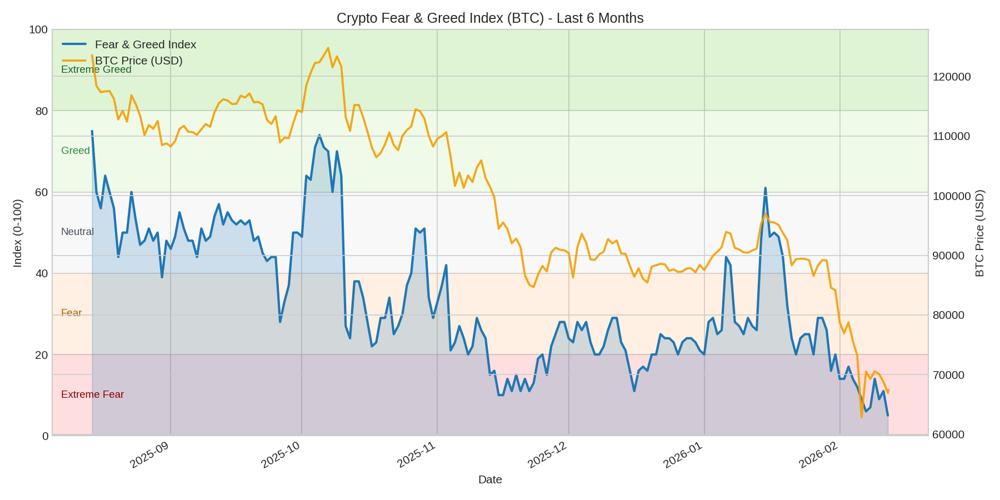

# Fear Indicator Telegram Bot (BTC)

[繁體中文 README](README.md)

This is a small tool that automatically fetches BTC market sentiment data, generates charts, and sends updates to Telegram.

## Telegram Message Format

The script outputs:

```text
📊 BTC Market Sentiment Update
🧭 Latest Index: 52 (Neutral 😐)
🔁 Change vs Previous: +3
🕒 Time: 2026-02-14 12:00 UTC
🔗 spearman correlation:0.32 (weak, positive correlation 📈)
```



## Why Track the Fear & Greed Index?

Crypto markets are often emotion-driven. The Fear & Greed Index quantifies market sentiment on a `0 ~ 100` scale:
- `0~19`: Extreme Fear
- `20~39`: Fear
- `40~59`: Neutral
- `60~79`: Greed
- `80~100`: Extreme Greed

Key value:
- Helps identify when the market is overly fearful or overly optimistic
- Reduces purely subjective decision-making
- Works as a supporting indicator with price/risk management, not a standalone buy/sell signal

## Why Use Spearman Correlation Here?

This project calculates:
- BTC `1-day return`
- Fear & Greed Index `1-day return`

Then uses Spearman correlation to evaluate whether they move in the same or opposite direction over the last 6 months.

Why Spearman:
- More robust for non-linear but monotonic relationships
- Less sensitive to outliers than Pearson
- Better suited for noisy financial time series

Note: correlation does not imply causation; it only describes relationship strength and direction.

## Features

- Fetches Crypto Fear & Greed Index from Alternative.me
- Fetches BTC daily prices from CoinGecko
- Generates a 6-month chart
- Computes 6-month Spearman correlation (missing values are forward-filled)
- Sends Chinese summary text + image to Telegram

## Project Structure

```text
.
├─ src/
│  └─ fear_indicator.py
├─ docs/
│  └─ sample_chart.png
├─ output/
├─ requirements.txt
├─ .env.example
├─ .gitignore
├─ README.md
└─ README_EN.md
```

## Installation and Run

```bash
python -m venv .venv
# Windows
.venv\Scripts\activate
# macOS / Linux
# source .venv/bin/activate

pip install -r requirements.txt
```

Create `.env`:

```env
TELEGRAM_BOT_TOKEN=your_bot_token
TELEGRAM_CHAT_ID=your_chat_id
```

Run:

```bash
python src/fear_indicator.py
```

Optional custom chart output path:

```bash
python src/fear_indicator.py --chart-path output/fear_greed_last_6_months.png
```

## Notes

- This tool provides market relationship insights and is not investment advice
- Correlation does not imply causation
- It is recommended to schedule this script to run once per day for continuous monitoring
